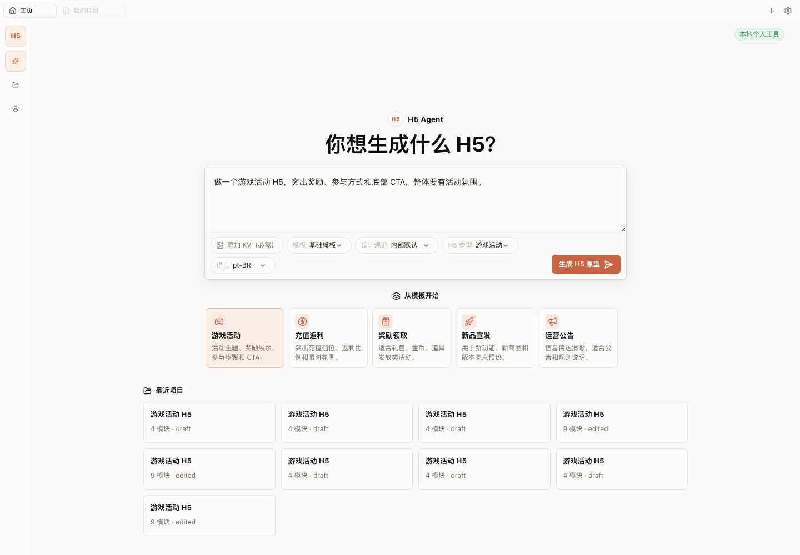
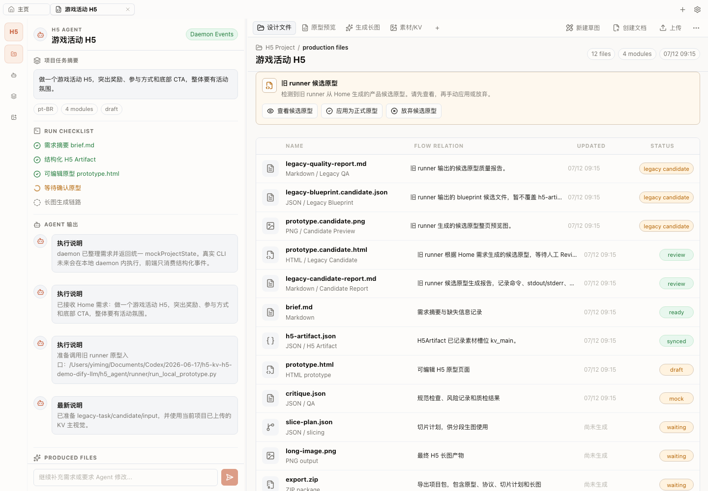
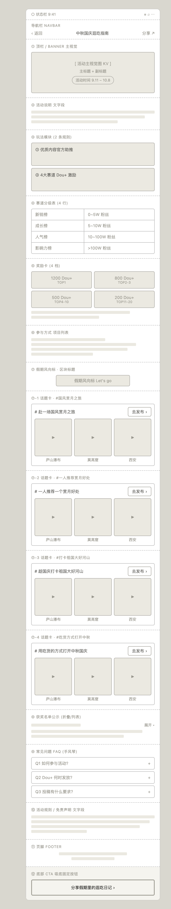

# H5 自动生图工作台

这是一个课程作业 / 原型验证项目。

一句话说：我想做一个「帮人把活动 H5 需求变成可编辑原型，再生成长图」的 AI 工作流工作台。

它现在还不是完整商业产品，也不是已经能稳定出最终商用图的一键工具。它更像一个半成品原型：用来证明我已经把真实需求拆开，并且把“需求输入、原型生成、人工修改、长图生成、质检导出”这条工作流搭出了第一版。

## 给第一次打开的人看

如果你不懂代码，可以先只看这一段。

我遇到的真实问题是：做活动 H5 或商单 H5 时，手里通常会有 KV 图、活动文案、奖励、规则和风格要求，但最后要交付的是一张完整的 H5 长图。

传统做法要么靠人一点点搭页面，要么直接让 AI 一次性出图。前者慢，后者不可控，尤其是后面要改文案、换模块、补素材、局部重做时很麻烦。

所以我的思路是：

```text
先别急着让 AI 出最终图
先让 AI 生成一个可以预览、可以修改的 H5 原型
人确认原型以后
再进入切片、生图、拼接、质检和导出
```

这个仓库就是围绕这个思路整理出来的第一版项目。

## 和作业要求的对应关系

| 作业要求 | 我这里对应的内容 |
| --- | --- |
| 找到真实需求场景 | 活动 H5 / 商单 H5 从 KV、文案、规则到长图的生产流程太散、修改成本高 |
| 找到方案视频并学习 | 参考 AI 工作流拆解类视频，学习“先拆流程，再让 AI 接手适合自动化的环节” |
| 用自己的话写出方案 | 本仓库把方案拆成需求输入、原型生成、人工确认、长图生成、质检导出 |
| 进阶：升级或降本 | 把旧的一次性脚本执行方式，升级成一个有 Home、项目工作区、Agent 面板和文件产物区的工作台 |
| 成品链接 | 当前这个 GitHub 仓库就是公开成品链接 |
| 当前状态 | 半成品公开展示版，真实最终生图和正式导出还没完全接上；公开仓库保留工作流骨架、协议、样例、截图和代码包说明，完整源码暂不公开 |

## 可以直接看的东西

不想跑代码的话，可以先看这几个文件：

1. [`00_新工作台主入口.md`](00_新工作台主入口.md)：这个项目到底想做什么。
2. [`01_产品定义/05_H5_Agent生产工作台_PRD_v0.1.md`](01_产品定义/05_H5_Agent生产工作台_PRD_v0.1.md)：更完整的产品说明。
3. [`02_H5_Artifact协议/README.md`](02_H5_Artifact协议/README.md)：为什么不能只保存一张图，而要保存结构化产物。
4. [`06_本地Pipeline/README_模块分层.md`](06_本地Pipeline/README_模块分层.md)：我把流程拆成了哪些步骤。
5. [`08_样例与验收/发布前验收_20260709.md`](08_样例与验收/发布前验收_20260709.md)：已经跑通过的样例和验收记录。

## 视觉预览

这是产品首页，用户从这里输入需求、上传 KV、选择 H5 类型和模板：



这是当前产品工作台界面截图：



这是原型编辑器的线框参考：



这是已跑通样例里的 H5 原型长图：


## 公开说明

这个公开版本重点展示项目思路、工作流拆解、协议设计、组件化生产方式和当前界面结果。

公开仓库中保留：

- 产品定义、H5 Artifact 协议、组件库、设计规范和本地 Pipeline 说明。
- 已跑通样例、发布前验收记录和原型编辑器参考。
- 产品首页、工作台界面、原型长图等视觉预览。
- `10_产品代码包/README.md` 中的公开版代码包说明。

公开仓库中不包含：

- 完整 Web 工作台、daemon、runner 适配层和本地工程源码。
- `node_modules/`
- `.h5-workbench/` 本地运行缓存、当前项目状态和历史快照。
- `dist/` 构建产物。
- 本地密钥、环境变量或真实线上服务配置。

## 项目定位

目标产品是：

```text
组件化 H5 Agent 生产工作台
```

核心流程：

```text
需求输入
-> Agent 补问信息
-> 生成规范化 H5 原型
-> 人在原型阶段修改文案、组件、顺序和主题
-> 基于确认后的原型生图
-> 输出 H5 长图
-> 后续支持局部修改和版本管理
```

## 推荐阅读顺序

1. `00_新工作台主入口.md`
2. `01_产品定义/05_H5_Agent生产工作台_PRD_v0.1.md`
3. `02_H5_Artifact协议/README.md`
4. `02_H5_Artifact协议/样例_已跑通/`
5. `03_组件库/component_registry_v0.1.json`
6. `04_设计规范/H5原型生成知识库_单文件版.md`
7. `06_本地Pipeline/代码项目引用.md`
8. `10_产品代码包/README.md`

## 目录说明

```text
00_新工作台主入口.md    新项目当前主入口
00_项目文档/            当前项目说明和 PRD
01_产品定义/            新产品定义、旧 PRD 参考
02_H5_Artifact协议/     原型 JSON、结构化产物和已跑通样例
03_组件库/              H5 组件 registry、执行 Skills、Figma 解析结果
04_设计规范/            内部 H5 规范、知识库和原始组件说明
05_Agent流程/           Codex/Agent 执行规则和旧产品包入口逻辑
06_本地Pipeline/        原型、渲染、切片、拼接、质检链路说明
07_原型编辑器/          可编辑原型和未来编辑器参考
08_样例与验收/          已跑通样例、验收结果和质量报告
09_历史参考_不自动运行/ 旧链路索引，只作参考，不作为新项目主入口
10_产品代码包/          公开版代码包说明，完整源码暂不公开
```

## 当前重要判断

旧项目的底层链路有价值，但旧项目的产品形态偏执行包。

新项目要从“Codex 打开文件夹生成一张长图”，转向“用户在工作台中生成、编辑、确认和导出 H5”。

`05_Agent流程/` 中的文件来自旧 Codex 产品包，只作为旧流程参考，不是新项目主入口。

## 不做的事

第一阶段不做：

- 多人实时协作
- 完整账号体系
- 对外商业化平台
- 完整自由画布
- 历史 Dify/ComfyUI 链路复活为主入口

## 关于代码

公开版暂不提供完整可运行源码。当前仓库用于展示课程作业里的需求拆解、工作流设计、产品形态、协议样例和界面预览。

产品截图来自本地半成品原型。完整工程先保留在本地，后续等代码整理、脱敏、说明补齐以后，再考虑发布成真正适合公开维护的版本。

不跑代码也不影响理解作业内容；这个公开仓库更像一份“能看懂的项目成品说明”，不是给别人直接部署上线的工程包。

## 旧项目来源

旧项目目录：

```text
/Users/yiming/Desktop/h5自动生图项目文档（正在跑）
```

当前代码实现参考：

```text
/Users/yiming/Documents/Codex/2026-06-17/h5-kv-h5-demo-dify-llm
```

本文件夹中的内容是复制整理，不会影响旧项目原文件。
